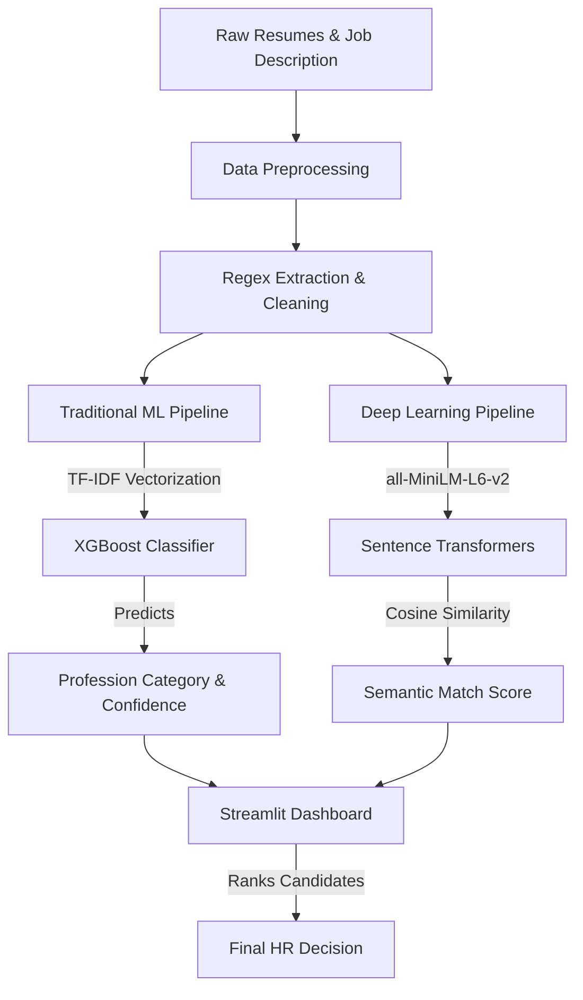

# 🎯 AI Resume Screening & Matching System


## 📌 Project Overview
An intelligent, end-to-end Machine Learning pipeline designed to automate the resume screening process. This system leverages both **Traditional Machine Learning (XGBoost + TF-IDF)** for profession classification and **Deep Learning (PyTorch + Sentence Transformers)** for semantic candidate-to-job matching.

By automating the first-pass screening, this tool helps HR professionals and technical recruiters quickly identify the most suitable candidates based on contextual meaning rather than just exact keyword matches.

---

## 🏗️ System Architecture

The pipeline consists of three main phases: Data Preprocessing & Feature Engineering, Model Training, and Inference (via Streamlit UI).



---

## ✨ Key Features & Technical Implementations

### 1. Advanced Feature Engineering
- **Regex Extraction:** Automated parsing of years of experience and contact information cleaning.
- **Skill Taxonomy Matching:** Computes the skill overlap ratio between the candidate's resume and the target job description against a predefined tech stack taxonomy.
- **TF-IDF Vectorization:** Extracts the top 5,000 most significant word features across the corpus.

### 2. Traditional Machine Learning (Classification)
Trained and evaluated 5 different algorithms to predict the applicant's core profession out of 24 distinct categories:
- **Logistic Regression:** 65.59% Accuracy
- **Naive Bayes:** 54.53% Accuracy
- **SVM (LinearSVC):** 71.43% Accuracy
- **Random Forest:** 68.81% Accuracy
- **🏆 XGBoost:** **77.87% Accuracy** *(Selected for final deployment)*

### 3. Deep Learning Semantic Matching
- Overcomes the limitation of traditional "Keyword Matching" ATS systems.
- Utilizes **Sentence Transformers (`all-MiniLM-L6-v2`)** via PyTorch to generate high-dimensional embeddings of both the resume and the job description.
- Calculates Cosine Similarity to provide a semantic **Match Score (0-100)**. It understands that "Software Engineer" and "Backend Developer" are contextually highly relevant.

---

## 🛠️ Tech Stack

| Category | Technologies Used |
|----------|-------------------|
| **Core ML** | `scikit-learn`, `XGBoost` |
| **Deep Learning** | `PyTorch`, `sentence-transformers`, `transformers` |
| **Data Processing** | `pandas`, `numpy`, `nltk`, `re` |
| **Frontend/UI** | `streamlit` |
| **Model Serialization** | `joblib` |
| **Visualization** | `matplotlib`, `seaborn` |

---

## 📂 Repository Structure

```text
AI-Resume-Screener/
├── app/
│   └── app.py                     # Streamlit web application
├── data/
│   ├── raw/                       # Original downloaded CSVs
│   └── processed/                 # Cleaned datasets ready for training
├── models/                        # Serialized ML artifacts (.pkl)
├── notebooks/
│   ├── 01_eda.ipynb               # Exploratory Data Analysis
│   ├── 02_feature_engineering.ipynb
│   ├── 03_sklearn_models.ipynb    # Training & evaluation of 5 ML models
│   ├── 04_pytorch_model.ipynb     # Semantic matching exploration
│   ├── 05_comparison.ipynb        # ML vs DL metric comparison
│   └── 06_create_model.ipynb      # Final XGBoost model export script
├── src/
│   ├── data_processing.py         # Text cleaning and Regex extractors
│   ├── feature_engineering.py     # Skill matching and feature extraction
│   ├── sklearn_pipeline.py        # ML training pipelines
│   └── pytorch_pipeline.py        # Semantic matcher class
├── README.md
└── requirements.txt
```

---

## 🚀 How to Run Locally

### 1. Clone the repository
```bash
git clone https://github.com/WillyHanafi1/AI-Resume-Screener.git
cd AI-Resume-Screener
```

### 2. Set up the Virtual Environment
```bash
python -m venv venv
# On Windows:
venv\Scripts\activate
# On Mac/Linux:
source venv/bin/activate

pip install -r requirements.txt
```

### 3. Generate the Machine Learning Models
Before running the app, you must train the model and generate the `.pkl` files.
Open `notebooks/06_create_model.ipynb` in your IDE and **Run All Cells**. This will populate the `/models` directory with:
- `xgb_model.pkl`
- `tfidf.pkl`
- `encoder.pkl`

### 4. Run the Streamlit Application
```bash
streamlit run app/app.py
```
Upload `.txt` resumes, paste a target Job Description, and let the AI rank the best candidates for you!

---

## 📈 Future Improvements
- Add OCR parsing for `.pdf` and `.docx` using `pdfplumber` and `pytesseract`.
- Implement LangChain / LLM (GPT-4o / LLaMA-3) to generate human-readable justifications for why a candidate was ranked highly.
- Expand the predefined skill taxonomy dynamically using a Knowledge Graph.
